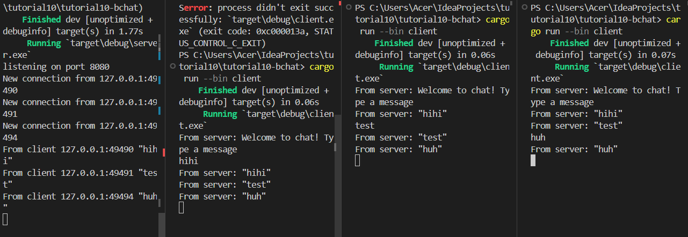

Exercise 2.1:

Untuk menjalankannya seperti screenshot diatas, bukalah 4 terminal. Di salah satunya, dimasukkan 'cargo run --bin server' dan di yang lain dimasukkan 'cargo run --bin client'

Exercise 2.2:

Untuk mengubah port dari 2000 menjadi 8080, yang diubah adalah:
- server.rs
'let listener = TcpListener::bind("127.0.0.1:2000").await?;'
menjadi
'let listener = TcpListener::bind("127.0.0.1:8080").await?;'

- client.rs
'ClientBuilder::from_uri(Uri::from_static("ws://127.0.0.1:2000"))'
menjadi
'ClientBuilder::from_uri(Uri::from_static("ws://127.0.0.1:8080"))'

Selain server.rs dan client.rs, tidak ada file yang lain yang perlu diubah. server.rs menggunakan TCP dan client.rs menggunakan websocket. Ini bisa dilakukan karena lapisan transportasi yang mendasari websocket adalah TCP.

Exercise 2.3:

Pada server.rs, saya mengubah 'let client_info = format!("{text:?}");' menjadi 'let client_info = format!("{addr:?}: {text:?}");'
Ini dilakukan supaya client_info yang disend ke seluruh client tidak hanya berupa teks, tapi juga address dari client yang menulisnya.